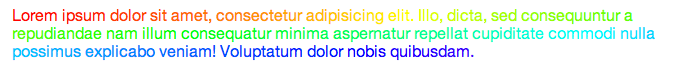

# Rainbow

We all need colors in sad webpage : so why not transform your text to a rainbow !

## How to use

Install it first

```
bower install Rainbow
```

- Simply add the class 'rainbow' to your elements and the script will do his work.

```html
<h1 class="rainbow">Double Rainbow</h1>
```


- Manually call Rainbow and passe your element as a first params.

```js
var title = document.querySelector('h1.title');
Rainbow(title);
```

Rainbow will works no mater the size of your text !



## Configuration

You can configure your super rainbow : his saturation and lightness.
You have two possibilites :

- Add `data-saturation` or|and `data-lightness` to your DOM element

```html
<h2 class="rainbow" data-saturation="40%" data-lightness="80%">Config Rainbow</h2>
```


- Add the configuration object as a second params

```js
var subTitle = document.querySelector('h2.title');
Rainbow(subTitle, {
  saturation: '40%',
  lightness: '80%'
  });
```


NB: if both are set, the configuration object will have the priority.

## License

The MIT License (MIT)

Copyright (c) 2014 Gaël Gillard

Permission is hereby granted, free of charge, to any person obtaining a copy
of this software and associated documentation files (the "Software"), to deal
in the Software without restriction, including without limitation the rights
to use, copy, modify, merge, publish, distribute, sublicense, and/or sell
copies of the Software, and to permit persons to whom the Software is
furnished to do so, subject to the following conditions:

The above copyright notice and this permission notice shall be included in all
copies or substantial portions of the Software.

THE SOFTWARE IS PROVIDED "AS IS", WITHOUT WARRANTY OF ANY KIND, EXPRESS OR
IMPLIED, INCLUDING BUT NOT LIMITED TO THE WARRANTIES OF MERCHANTABILITY,
FITNESS FOR A PARTICULAR PURPOSE AND NONINFRINGEMENT. IN NO EVENT SHALL THE
AUTHORS OR COPYRIGHT HOLDERS BE LIABLE FOR ANY CLAIM, DAMAGES OR OTHER
LIABILITY, WHETHER IN AN ACTION OF CONTRACT, TORT OR OTHERWISE, ARISING FROM,
OUT OF OR IN CONNECTION WITH THE SOFTWARE OR THE USE OR OTHER DEALINGS IN THE
SOFTWARE.
